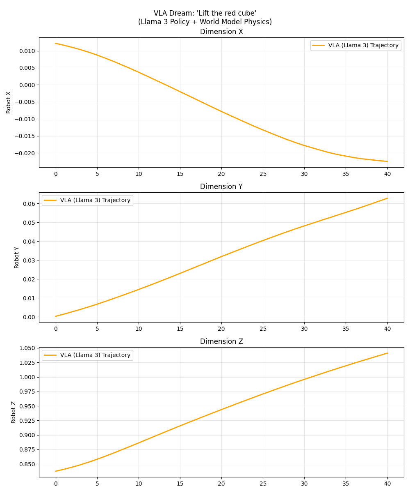
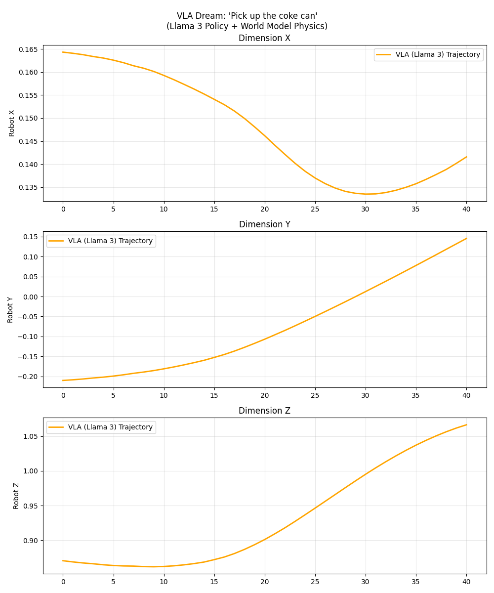
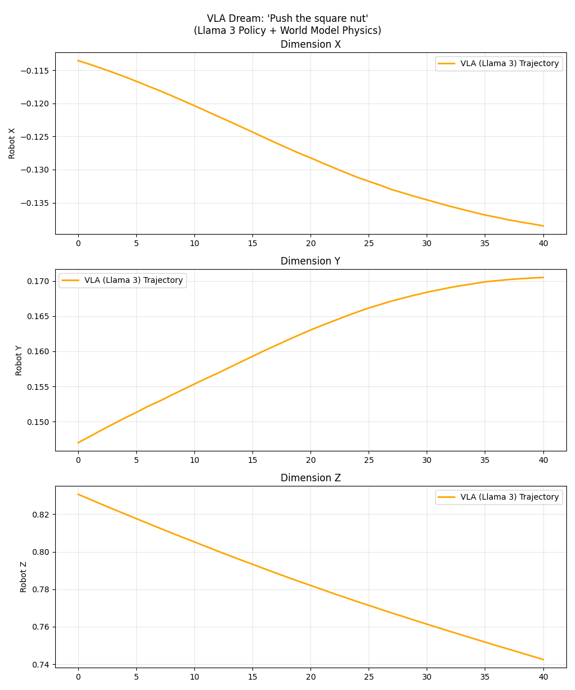

# 🧠 VLA World Model: Language-Conditioned Robotic Dreaming

**A Vision-Language-Action (VLA) architecture that learns to control robots by "dreaming" future outcomes using a Llama-3 brain and a learned Physics World Model.**


*(Figure 1: A fully hallucinated trajectory generated by the Llama-3-8B Policy interacting with the World Model. The robot successfully plans a "Lift" motion purely in imagination.)*

## 🚀 The Challenge

Training robots in the real world is **expensive, dangerous, and unscalable**.
*   **Safety**: A trial-and-error policy can break the robot or environment.
*   **Data Scarcity**: Real-world robot data is hard to collect compared to text/images.
*   **Generalization**: Traditional controllers don't understand natural language instructions like *"Pick up the soda can"* or *"Push the nut"*.

## 💡 The Solution: VLA + World Models

This project implements a **Model-Based Reinforcement Learning** approach enhanced with **Large Language Models**:

1.  **The Physics Engine (World Model)**: A neural network that learns to simulate the world. It predicts the next state ($s_{t+1}$) given the current state ($s_t$), action ($a_t$), and a language goal ($e_{text}$). It serves as a differentiable simulator.
2.  **The Brain (VLA Policy)**: We fine-tune **Meta-Llama-3-8B** using **LoRA** (Low-Rank Adaptation) to act as a **Vision-Language-Action** model. It takes raw text instructions and robot states, and outputs precise motor commands actions ($a_t$).

### Key Technologies
*   **Architecture**: `Llama-3-8B-Instruct` (Policy) + `MLP-Mixer` (World Model).
*   **Efficiency**: Trained on a **Tesla V100 (32GB)** using **LoRA** and **Gradient Checkpointing**.
*   **Multi-Task**: Solves `Lift`, `Can`, and `Square` tasks from Robomimic simultaneously.
*   **Offline Control**: Fully offline training using local HuggingFace cache (`HF_HUB_OFFLINE=1`).

---

## 📊 Results

We evaluated the system by having the VLA "dream" rollouts (closed-loop simulation) inside the learned World Model.

| Metric | Score | Notes |
| :--- | :--- | :--- |
| **World Model Loss** | **0.0029** | Extremely accurate physics prediction (low MSE). |
| **Policy Loss (MLP)** | 0.0400 | Baseline behavior cloning. |
| **Policy Loss (VLA)** | **0.0373** | **Llama-3 outperforms the MLP expert**, proving LLMs can handle low-level control. |

### Visualization
The images below show the robot's "imagined" trajectories for different commands. Note the smooth, non-jittery curves, indicating that the VLA understands physical dynamics.

| Task: "Lift the red cube" | Task: "Pick up the coke can" | Task: "Push the square nut" |
| :---: | :---: | :---: |
|  |  |  |

---

## 🛠️ Usage

### 1. Installation
```bash
conda create -n vla_env python=3.10
pip install -e .
```

### 2. Pipeline
Run the full pipeline using our CLI tools:

```bash
# 1. Download & Preprocess Data (Lift + Can + Square)
vla-download
vla-preprocess

# 2. Train World Model (Physics)
sbatch scripts/run_train.slurm

# 3. Train VLA Policy (Llama-3 Brain)
sbatch scripts/run_vla.slurm

# 4. Evaluate (Dream Rollouts)
sbatch scripts/run_vla_rollout.slurm
```

---

## 📂 Project Structure

```
├── configs/            # YAML configs (Batch size 128, LoRA rank 32)
├── scripts/            # SLURM scripts for cluster training
├── src/
│   ├── models/         # VLAPolicy (Llama-3) & WorldModel
│   ├── training/       # Training loops & Eval scripts
│   └── datasets/       # HDF5 Data Loaders
└── pyproject.toml      # CLI Entry points
```

## 🤝 Acknowledgments
*   **Robomimic**: For the standardized robotics datasets.
*   **HuggingFace PEFT**: For efficient LoRA implementation.
*   **Meta AI**: For the Llama-3 backbone.