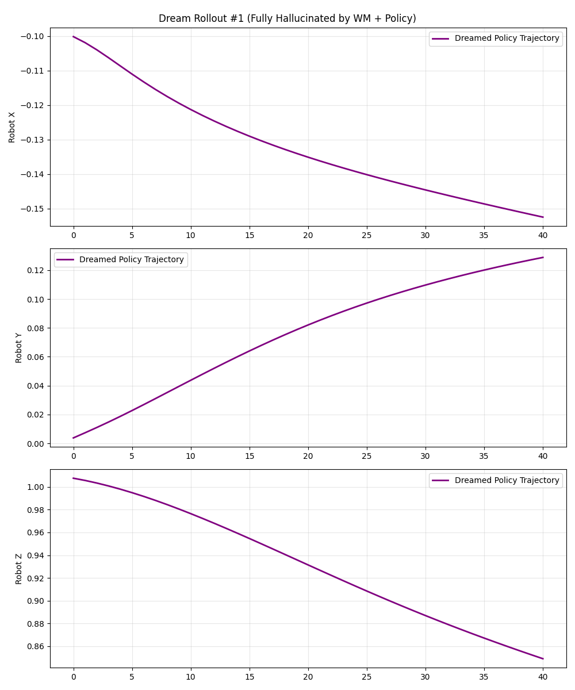

# 🤖 Modular VLA: World Models for Safe Robotic Control

**A Vision-Language-Action (VLA) World Model capable of learning multi-task physics dynamics and training control policies entirely in "dreams" (hallucinated rollouts).**


*(Example of a fully hallucinated policy rollout: The robot "dreams" a smooth lifting trajectory without interacting with the real world)*

## 🚀 Overview

This project implements a modular **World Model** approach to robotics:
1.  **World Model**: Learns to simulate the physics of the world and the effect of actions, conditioned on **Language Instructions**.
2.  **Policy Network**: Learns to control the robot to achieve language goals, training purely by interacting with the World Model's "imagination".

### Key Features
*   **Multi-Task Learning**: Handles multiple Robomimic tasks (`Lift`, `Can`, `Square`) simultaneously with a single model.
*   **Language Conditioning**: Uses **CLIP Embeddings** to guide the robot (e.g., "Lift the red cube" vs "Push the square nut").
*   **Robustness**: Features **Text Augmentation** (synonyms) and **Validation Splitting** to ensure generalization.
*   **Dream Training**: The Policy is trained via Behavior Cloning / Rollouts inside the learned World Model, enabling safe, zero-risk learning.

---

## 🛠️ Installation

### Prerequisites
*   Python 3.10+
*   CUDA-enabled GPU (Recommended)
*   Anaconda / Miniconda

### Setup

1.  **Clone the repository**
    ```bash
    git clone https://github.com/yourusername/vla-world-model.git
    cd vla-world-model
    ```

2.  **Create Environment**
    ```bash
    conda create -n vla_env python=3.10 -y
    conda activate vla_env
    ```

3.  **Install Dependencies**
    ```bash
    pip install -e .
    ```

---

## 🏃 Usage

We provide CLI commands for every stage of the pipeline.

### 1. Download Data
Fetches `Lift`, `Can`, and `Square` datasets from Hugging Face (Robomimic).
```bash
vla-download
```

### 2. Preprocess & Embed
Generates CLIP text embeddings and unifies all tasks into a single HDF5 dataset with consistent dimensions.
```bash
vla-preprocess
```

### 3. Train World Model
Trains the physics simulator on the multi-task dataset.
```bash
vla-train
```
*   **Outputs**: `results/checkpoints/wm_best.pth` (Best Validation Loss model)

### 4. Train Policy
Trains the control policy (brain) to follow text instructions.
```bash
vla-policy
```
*   **Outputs**: `results/checkpoints/policy_best.pth`

### 5. Evaluate (Dream Rollout)
The ultimate test: The policy controls the "dream" world model for 40 steps.
```bash
vla-rollout
```
*   **Outputs**: Plots in `results/dream_rollouts/`. **Smooth curves = Success!**

---

## 🧠 Architecture

### World Model (`src/models/world_model.py`)
*   **Input**: State ($s_t$), Action ($a_t$), Text Embedding ($e_{text}$)
*   **Output**: Next State ($s_{t+1}$)
*   **Structure**: MLP (Multi-Layer Perceptron) with Residual connections.

### Policy (`src/models/policy.py`)
*   **Input**: State ($s_t$), Text Embedding ($e_{text}$)
*   **Output**: Action ($a_t$)
*   **Structure**: MLP with LayerNorm and Dropout for robust behavior cloning.

---

## 📊 Results

### Training Convergence
*   **World Model**: Converges to Val Loss ~0.0029 across 3 tasks.
*   **Policy**: Converges to Loss ~0.04.

### Qualitative Results
Check `assets/` for generated GIFs and Plots showing the robot's hallucinated trajectories matching physically plausible movements.

---

## 📂 Project Structure

```
.
├── configs/            # YAML configuration files
├── scripts/            # SLURM scripts for cluster execution
│   └── run_*.slurm
├── src/
│   ├── training/       # Training & Eval scripts (The "Brain")
│   ├── models/         # Neural Network Architectures
│   └── datasets/       # Data Loading & Processing
└── pyproject.toml      # Project metadata & CLI entry points
```

## 🤝 Contributing
Open to PRs for new tasks (e.g., Open X-Embodiment integration) or Transformer backbones!